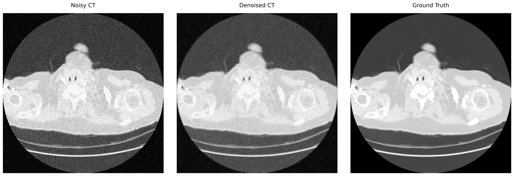

# CT Image Denoising Using Convolutional Neural Networks (CNNs)

This project explores the use of deep learning techniques for CT image denoising using Convolutional Neural Networks (CNNs) implemented in PyTorch. The primary objective is to improve noisy CT image quality while preserving important anatomical structures and image details.

## Project Motivation

Low-dose CT imaging is commonly used to reduce radiation exposure to patients; however, lowering the radiation dose introduces increased image noise and degradation in image quality. Image denoising techniques based on deep learning have shown promising results in reconstructing cleaner images while preserving diagnostically important features.

**This project serves as an introductory exploration into:**

- Medical image processing
- Deep learning for medical imaging
- CT image denoising
- CNN-based image reconstruction
- Evaluation using image quality metrics
## Methods

## Project Pipeline

1. Loading and preprocessing CT DICOM images
2. HU conversion and CT windowing
3. Image normalization
4. Addition of synthetic Gaussian noise
5. Conversion of NumPy arrays to PyTorch tensors
6. CNN-based denoising using PyTorch
7. Training using MSE Loss and Adam Optimizer
8. Evaluation using PSNR and SSIM metrics

## CNN Architecture

The implemented CNN architecture consists of:

- Convolutional layers for feature extraction
- ReLU activation for non-linearity
- Reconstruction layer for denoised image generation

The model was trained using:

- Mean Squared Error (MSE) Loss
- Adam Optimizer
- PyTorch deep learning framework
## Results

### Denoising Results




The CNN demonstrated improvement in image quality after denoising.

**Quantitative Metrics**
| Metric | Noisy Image | Denoised Image |
|---|---|---|
| PSNR | 22.69 | 29.32 |
| PSNR | 22.69 | 29.32 |

These results indicate improved structural similarity and reduced noise in the denoised CT images.

## Technologies Used
- Python
- PyTorch
- NumPy
- Matplotlib
- pydicom
- scikit-image
- Jupyter Notebook
- Visual Studio Code

## Repository Structure
```text
CT-Denoising-CNN/
│
├── CT_DL.ipynb
├── Notebook/
├── Data/
└── .gitignore
```
## Future Work

Future improvements planned for this project include:

- Training on multiple CT slices and datasets
- Implementing U-Net architectures
- Exploring GAN-based denoising
- Realistic low-dose CT noise simulation
- Comparative analysis with classical denoising methods
- Publication-oriented evaluation pipeline
## Author

**Rajinder Kaur**  
Ph.D. Physics  
Medical Imaging & Deep Learning Enthusiast
